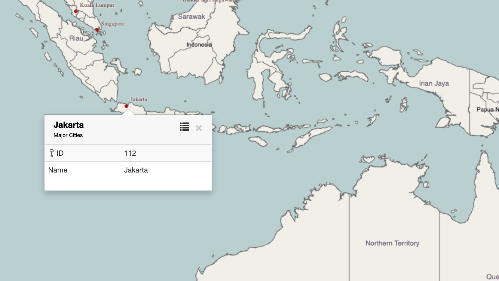
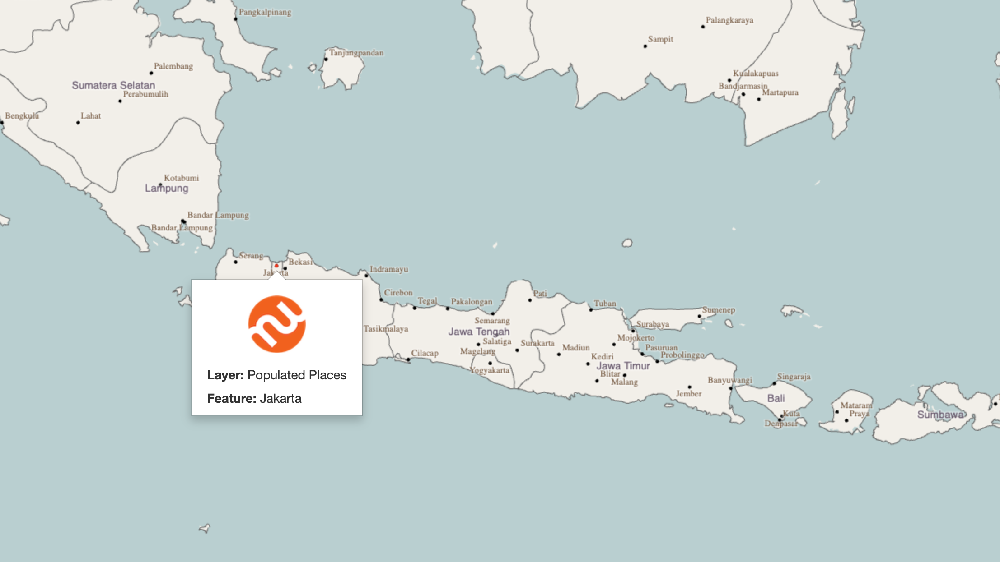
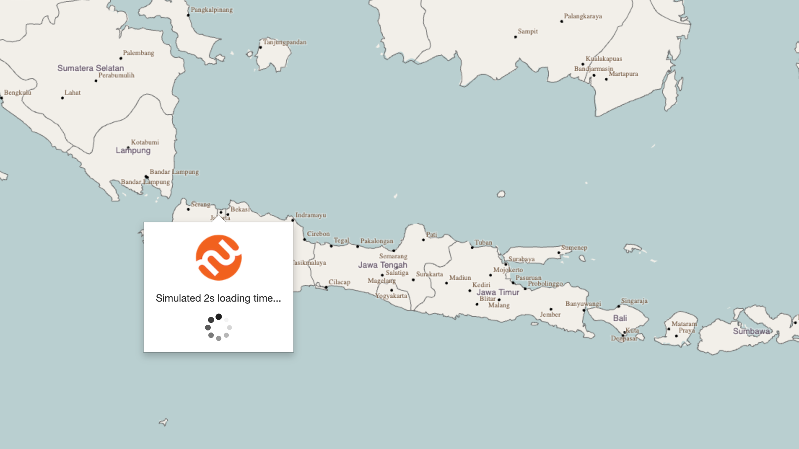

# Mapworks Mouseover, Mouse-click and Zoom-to Example (Angular)

This example illustrates writing a Mapworks Studio web application to customise:

1. Mouseover, tooltip and mouse-click display; and
2. The webapp initiated *zoom to feature* operation with a custom marker to
   highlight the point feature centred on the map. 
   In this example, each time this operation s a random feature is chosen 

The specfic use case includes accessing auth via Mapworks, and requiring
sign-in prior to the use of a Mapworks map component (via protected Angular routes).

This project was generated with [Angular CLI](https://github.com/angular/angular-cli) version 16.0.0.

## Running in CodeSandbox

This example may be run in CodeSandbox:

- https://codesandbox.io/p/github/mapworksio/mapworks-mouseover-zoomto-angular-example

## Map "feature" events

A Mapworks map provides a multitude of events relating to the user's interaction
with the map.

We focus on three in this example, being:

1. `feature:mouseover` - an instantaneous event emitted when the mouse pointer passes
   *over* a feature on the map. These are emitted at high volume during map interaction
   and it is often necessary to throttle the rate depending on the application. 

   In this example webapp, the mouseover events are captured, throttled to a rate of 10/second
   and displayed above the map (see (1) below).

2. `feature:tooltip` - a *"brief"* on-map tooltip, displayed after the mouse pointer is hovered 
   (paused in the same location) for a small period. The default tooltip makes use of the
   features **queryable** fields and the **Tooltip Text Format** string (set in *Layer Styles*).

3. `feature:mouseclick` - a *"fuller"* on map display which is shown after the user clicks on
   a feature on the map. The default mouse click display loads all fields for the feature (from
   the Mapworks server) and displays them in tabular form.

As well as the default displays on the map, as described above, each of these events are 
available in code, and the example webapp displays them as follows:

Refer to the following in the code:

- [src/app/main-app/map-events-display.component.ts](src/app/main-app/map-events-display.component.ts) -
  listens to the `MapworksMap` events and displays in the webapp.

The following is an example of a simple tooltip and mouse-click display for the OSM
*Populated Places* layer, as used in this example:

## Mouseover and tooltip customisation

The on-map display for both *tooltips* and *mouse-click* display may be customised.

Additionally, the mouse-click display may include a deferred/asynchronous update which 
enable web applications to obtain further data before updating the display.

In order to perform this customisation, it is neccessary to obtain the instance of the
`MapworksStudioTooltipControl` instance associated with the Studio map, and listen to the 
`before:render` event. This enables access to the context object (containing details
of the feature being displayed etc) to be accessed and the templates to be used for
display to be replaced or modified.

In this example web application:

1. The *tooltip* display utilises an Angular component displayed within the tooltip utilising
   [Angular elements](https://angular.io/guide/elements). See more below.

2. The *mouse-click* display utilises a simulated asychronous load (in this case a 2 second delay)
   and modifies the default tabular display by inserting the Mapworks logo.

The produces:

Note that in all cases, Mapworks take care of the correct positioning the displayed element 
with respect to the feature on the map.

Refer to the following in the code:

- [src/app/main-app/main-app.component.ts](src/app/main-app/main-app.component.ts) - the
  wiring for listening to the `before:render` events, customising the display templates
  and providing the context object to the custom element via `MouseoverDataProvider`.

### Angular elements 

To achieve Angular component-level integration for this example, Angular elements
(web *custom elements*, also called *Web Components*) are utilised.

Mapworks utilises HTML text (as `string`'s within the API) to provide content
for tooltip and mouse-click displays. The use of custom elements enables
the use of Angular components to be used for this use case.

Refer to the following in the code:

- [src/app/mapworks-map.service.ts](src/app/mapworks-map.service.ts) - registers the custom
  element and binds an injector for the `MouseoverDataProvider` class to provide
  the context object supplied by the Studio map event to the Angular component.

- [src/app/mouseover/mouseover.component.ts](src/app/mouseover/mouseover.component.ts) - the
  Angular elements component displayed in the tooltip and mour-click displays.

- [src/app/main-app/main-app.component.ts](src/app/main-app/main-app.component.ts) - the
  wiring for listening to the `before:render` events, customising the display templates
  and providing the context object to the custom element via `MouseoverDataProvider`.

### Standard templates

It may be helpful to refer to the standard Studio templates for tooltips and mouse-click 
displays:

- [docs/default-tooltip-template.md](docs/default-tooltip-template.md) - for displaying tooltips

- [docs/default-mouseclick-template.md](docs/default-mouseclick-template.md) - for displaying mouse-clicks

## Webapp initiated *Zoom to feature*

This example webapp performs the following:

1. Random selection of a map feature from within the OSM *Populated Places* layer.

2. Initiation of a smooth, animated *zoom to feature* operation to centre the map
   on the location of the selected feature.

3. Placement of a custom marker, utilising an animated SVG, to highlight the
   feature on the map.

   

Refer to the following in the code:

- [src/app/main-app/map-events-display.component.ts](src/app/main-app/map-events-display.component.ts) -
  the `doZoomTo()` method which initiates the animated zoom to (using the Studio API).

- [src/app/main-app/map-point-marker.class.ts](src/app/main-app/map-point-marker.class.ts) - 
  the implementation of a Studio `FeatureReporter` to display the marker icon on the map.

## Using the Mapworks code

The [src/app/mapworks](src/app/mapworks) subfolder may be copied and used directly in web application code.

- [src/app/mapworks](src/app/mapworks) - this contains the `MapworksMapService` class used to manage auth and map initialisation.
- [src/main.ts](src/main.ts) - contains code to handle the OAuth2/OIDC callback used as part of the sign in process (this will need to be incorporated or use `login-callback.html`)
- [src/assets/login-callback.html](src/assets/login-callback.html) - this handles the OAuth2/OIDC callback used as part of the sign in process (preferred in non-CodeSandbox environments)

Note that due to constraints of the CodeSandbox environment, the OAuth2/OIDC callback is handled in [src/main.ts](src/main.ts) - for non-CodeSandbox you are probably better utilising the static `login-callback.html` (`app-config.ts` needs to be updated to reflect this).

## Development server

Run `ng serve` for a dev server. Navigate to http://localhost:4200. The application will automatically reload if you change any of the source files.

## Code scaffolding

Run `ng generate component component-name` to generate a new component. You can also use `ng generate directive|pipe|service|class|guard|interface|enum|module`.

## Build

Run `ng build` to build the project. The build artifacts will be stored in the `dist/` directory.

## Running unit tests

Run `ng test` to execute the unit tests via [Karma](https://karma-runner.github.io).

## Running end-to-end tests

Run `ng e2e` to execute the end-to-end tests via a platform of your choice. To use this command, you need to first add a package that implements end-to-end testing capabilities.

## Further help

To get more help on the Angular CLI use `ng help` or go check out the [Angular CLI Overview and Command Reference](https://angular.io/cli) page.
